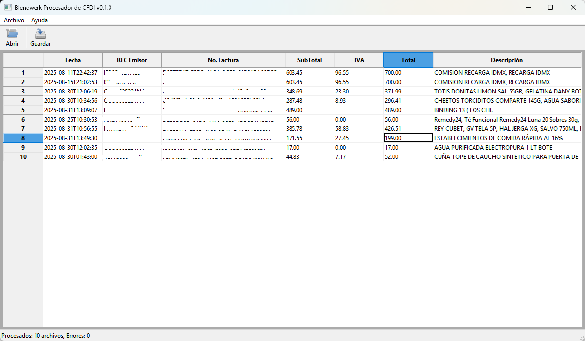

# Blendwerk CFDI Processor


A modern C++23 desktop application for processing Mexican CFDI (Comprobante Fiscal Digital por Internet) XML documents and extract key information that can be exported into CSV files for reporting and analysis. The application features a custom-built XML parser, batch processing capabilities, and exports data in multiple formats.



## Features

- **CFDI XML Parsing**: Custom XML parser built from scratch using C++23 modules
- **Batch Processing**: Scan entire directories for CFDI files
- **Multiple Export Formats**: Export summaries to CSV, JSON, or XML
- **Modern GUI**: Built with wxWidgets for native Windows look and feel
- **Type-Safe**: Leverages C++23 features for compile-time safety
- **Modular Architecture**: Organized using C++20/23 module system with partitions

## Architecture

The project is organized into four main C++ modules:

### **cfdi.xml** - XML Processing Module
Custom XML parser implementation with support for:
- Element parsing
- Attribute handling
- CDATA sections
- Comments and processing instructions
- Document type declarations

Key components:
- `XmlReader` - Main XML parsing interface
- `XmlNode` - DOM-like node representation
- `XmlBuffer` - Efficient text buffer with position tracking
- Various fragment parsers for different XML constructs

### **cfdi.doc** - CFDI Document Module
Business logic for CFDI documents:
- `CFDIDocument` - Main document model
- `CFDIHeader` - Document header information
- `CFDIIssuer` - Issuer (emisor) details
- `CFDIReceiver` - Receiver (receptor) details
- `CFDIConcept` - Line items (conceptos)
- `CFDITax` - Tax information (impuestos)
- `CFDISummary` - Document summary for reporting
- `CFDIScanner` - Directory scanner for batch processing
- `CFDIWritter` - Export to multiple formats (CSV, JSON, XML)

### **cfdi.util** - Utility Module
Helper functions and templates:
- `join()` - Range-based string joining with transformation support

### **cfdi.app** - Application Module
GUI application:
- `Application` - wxWidgets application entry point
- `Window` - Main application window with grid view

## 🔧 Technology Stack

- **Language**: C++23 
- **Build System**: CMake 4.1+
- **GUI Framework**: wxWidgets 3.2+
- **Package Manager**: vcpkg
- **Module System**: C++20 modules with partitions
- **Supported Compilers**:
  - MSVC 2022 (17.10+)  

## 📋 Prerequisites

### Required Tools
- CMake 4.1 or later
- Visual Studio 2022 (with C++ workload) 
- vcpkg package manager

### Environment Variables
Set the `VCPKG_ROOT` environment variable to your vcpkg installation directory:
```powershell
$env:VCPKG_ROOT = "C:\path\to\vcpkg"
```

## 🚀 Building the Project

### 1. Install Dependencies
```powershell
# Ensure vcpkg is installed and VCPKG_ROOT is set
vcpkg integrate install
```

### 2. Configure with CMake
Choose one of the available presets:

**For MSVC:**
```powershell
cmake --preset msvc
```

### 3. Build
```powershell
# For Debug build
cmake --build build/msvc --config Debug

# For Release build
cmake --build build/msvc --config Release
```

### 4. Run
```powershell
.\build\msvc\Debug\CFDI.exe
```

## 📁 Project Structure

```
app_cfdi_cpp/
├── src/
│   ├── cfdi.app/           # GUI application module
│   │   ├── cfdi.app.ixx    # Main module interface
│   │   ├── application.ixx # Application partition interface
│   │   ├── application.cpp # Application implementation
│   │   ├── window.ixx      # Window partition interface
│   │   └── window.cpp      # Window implementation
│   ├── cfdi.doc/           # CFDI document module
│   │   ├── cfdi.doc.ixx    # Main module interface
│   │   ├── cfdidocument.*  # Document model
│   │   ├── cfdiheader.*    # Header information
│   │   ├── cfdiissuer.*    # Issuer details
│   │   ├── cfdireceiver.*  # Receiver details
│   │   ├── cfdiconcept.*   # Line items
│   │   ├── cfditax.*       # Tax information
│   │   ├── cfdisummary.*   # Summary model
│   │   ├── cfdiscanner.*   # Directory scanner
│   │   └── cfdiwritter.*   # Export functionality
│   ├── cfdi.xml/           # XML parsing module
│   │   ├── cfdi.xml.ixx    # Main module interface
│   │   ├── xmlreader.*     # XML reader
│   │   ├── xmlnode.*       # Node representation
│   │   ├── xmlbuffer.*     # Text buffer
│   │   └── various parsers # Fragment parsers
│   └── cfdi.util/          # Utility module
│       └── cfdi.util.ixx   # Utility functions
├── data/                   # Sample CFDI XML files
├── installer/              # Installation scripts
├── CMakeLists.txt          # Main CMake configuration
├── CMakePresets.json       # CMake presets
└── vcpkg.json              # vcpkg manifest
```

## 🎯 Usage

1. **Launch the application**
   - Run `CFDI.exe` from the build directory

2. **Scan for CFDI files**
   - Click "Abrir" (Open) or press `Ctrl+A`
   - Select a directory containing CFDI XML files
   - The application will scan and display all found CFDIs

3. **View results**
   - Review the parsed CFDI data in the grid view
   - Columns include: Date, Description, Issuer RFC, Invoice Number, Subtotal, Tax, Total

4. **Export data**
   - Click "Guardar" (Save) or press `Ctrl+G`
   - Choose output format (CSV, JSON, or XML)
   - Select destination file
   - Data will be exported in the selected format

## 🔬 Key Features Implementation

### C++ Modules
The entire project is built using C++20 modules with module partitions for better compilation times and encapsulation:

```cpp
// Module interface
export module cfdi.doc:cfdidocument;

// Implementation
module cfdi.doc:cfdidocument;
```

### Global Module Fragment for wxWidgets
To work around wxWidgets' traditional header requirements:

```cpp
module;  // Global module fragment

#include <wx/wx.h>
// ... other wx includes

module cfdi.app:window;  // Module declaration
```

### Modern C++ Features
- **Ranges**: Used throughout for iteration and transformations
- **Concepts**: Type constraints for template parameters
- **std::format**: Modern string formatting
- **std::filesystem**: File and directory operations
- **Module system**: For better code organization

### Custom XML Parser
Built from scratch without external dependencies:
- .NET-style pull parser
- Support for all XML constructs
- Efficient memory usage with string views
- Position tracking for error reporting


## Development Notes

### Module Compilation Order
CMake automatically handles module dependency scanning and compilation order. The modules are compiled in this sequence:
1. `cfdi.util` (standalone)
2. `cfdi.xml` (standalone)
3. `cfdi.doc` (depends on xml)
4. `cfdi.app` (depends on doc)

### Adding New Partitions
When adding a new module partition:
1. Create the `.ixx` interface file
2. Create the `.cpp` implementation file (if needed)
3. Add both files to `CMakeLists.txt`
4. Export the partition from the main module interface

Example:
```cpp
// In cfdi.doc.ixx
export module cfdi.doc;
export import :newpartition;  // Add this line
```

## About

This is a proprietary project. Contact the maintainers for contribution guidelines.

### License

MIT License. See `LICENSE` file for details. Or go nuts with the code, 
some acknowledgments would be appreciated but it's not required. 

### Acknowledgments

- Mexican SAT (Servicio de Administración Tributaria) for CFDI specifications
- wxWidgets team for the excellent cross-platform GUI framework
